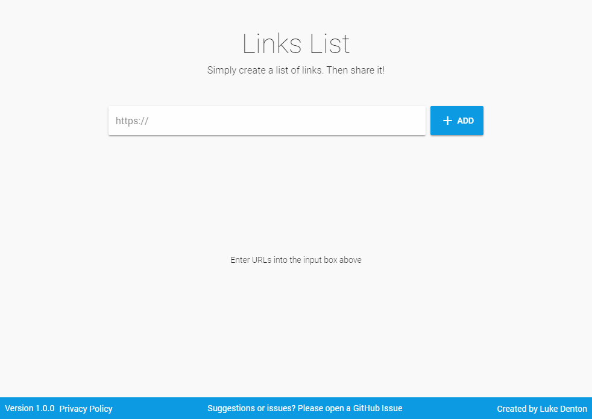

# Links List

> Create a list of links, then share it!



## Requirements

Global packages required:

* [Firebase Tools CLI](https://firebase.google.com/docs/cli/)
* [Vue CLI](https://cli.vuejs.org/)

Along with the tools above, a new Firebase project will need to be set up in your (Firebase Console)[https://console.firebase.google.com/]

## Getting Started

Check out the repository:

```bash
git clone https://github.com/denno020/linkslist.git
```
N.b. The folder name will need to be all lowercase in order to be able to configure the project with Firebase Tools CLI

## Development Set Up

### Firebase
After the repository has been cloned, navigate into the directory and initialise a new Firebase project,

```bash
firebase init
```
N.b. As you're going through `init` above, the CLI will ask if you wish to overwrite `functions/package.json` and `functions/index.js`,
select `No` for both.

**Then make the following updates**

* Update project ID's and API keys in `application-configuration.js`

* Set names of your database tables in `functions/tables.json`

### VueJs
Once Firebase is configured, the rest of the project can be configured,
 
```bash
yarn install
```
N.b. this is different to the `npm install` that Firebase Tools CLI asked if you'd like to run.

**Then make the following updates**

* [Optional] Update the Bugsnag ID in `src/main.js`
  * [Bugsnag](https://www.bugsnag.com/) is a great bug tracking library that will notify you via email when an error occurs on your site.
* [Optional] Update Google Analytis ID in `public/index.html`

## Development

To run the application locally

`yarn serve`

To use local copies of Firebase cloud functions

`firebase serve --only functions`

## Release history

* 1.0.0
  * Initial release

## Meta
Luke Denton - [@denno020](https://twitter.com/denno020) - linkslistapp@gmail.com

Distributed under the GNU General Public Licence. See `LICENCE` for more information.

[https://github.com/denno020/linkslist](https://github.com/denno020/linkslist)

## Contributing

1. Fork the repository ([https://github.com/denno020/linkslist](https://github.com/denno020/linkslist))
2. Create your feature branch (`git checkout -b feature/myFeature`)
3. Commit your changes (`git commit -am 'Added myFeature'`)
4. Push to the branch (`git push origin feature/myFeature`)
5. Create a [new Pull Request](https://github.com/denno020/linkslist/compare)
